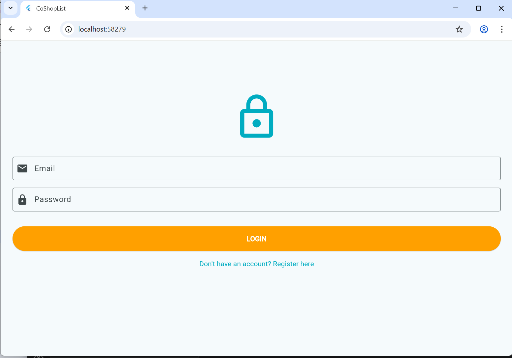
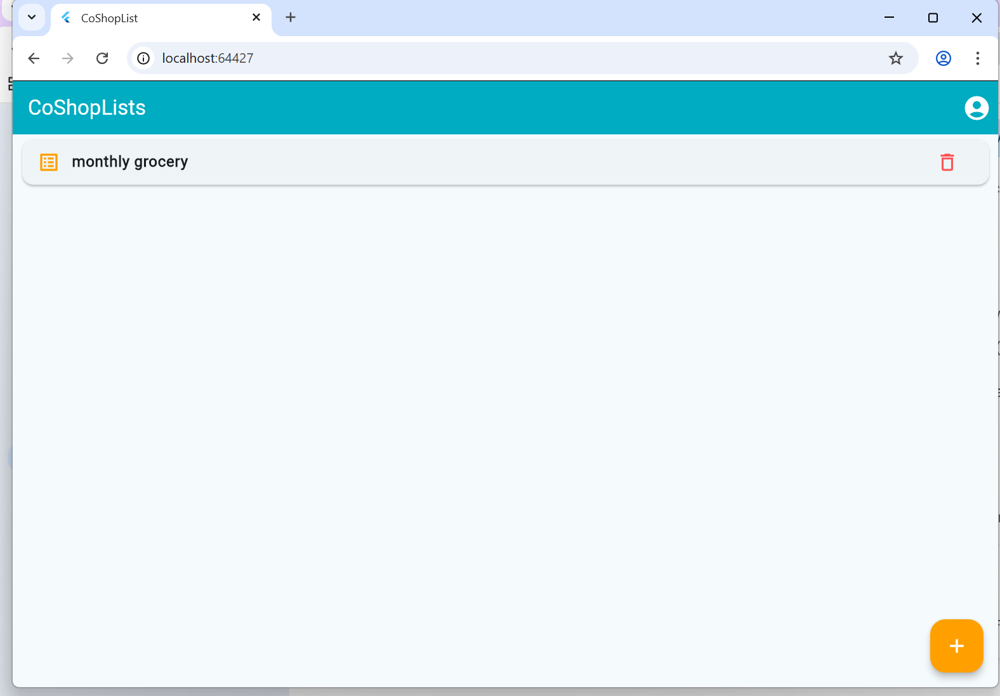
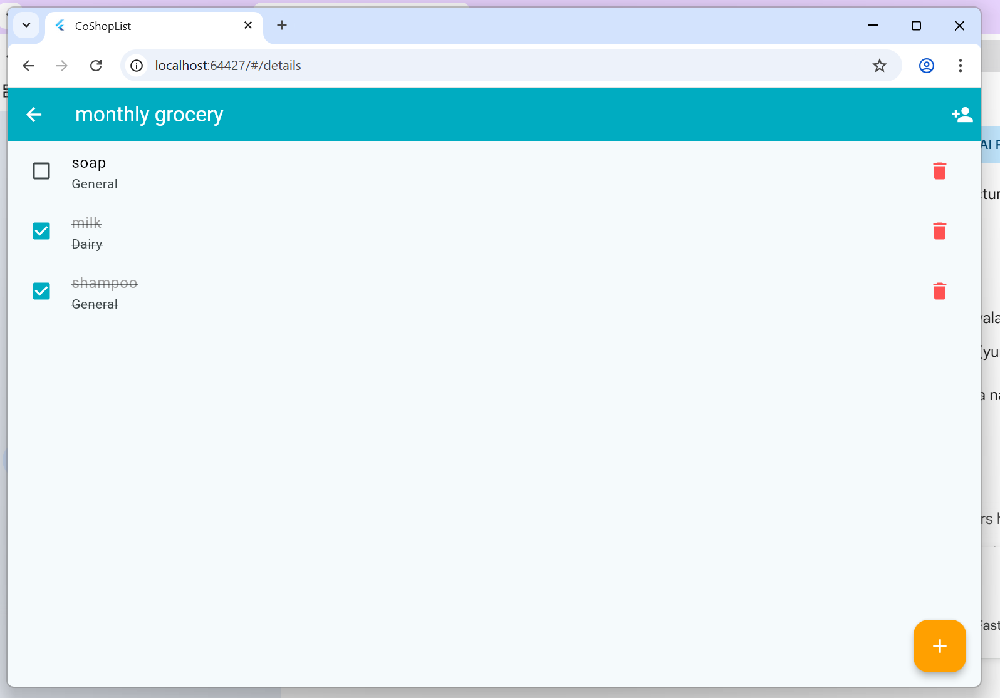
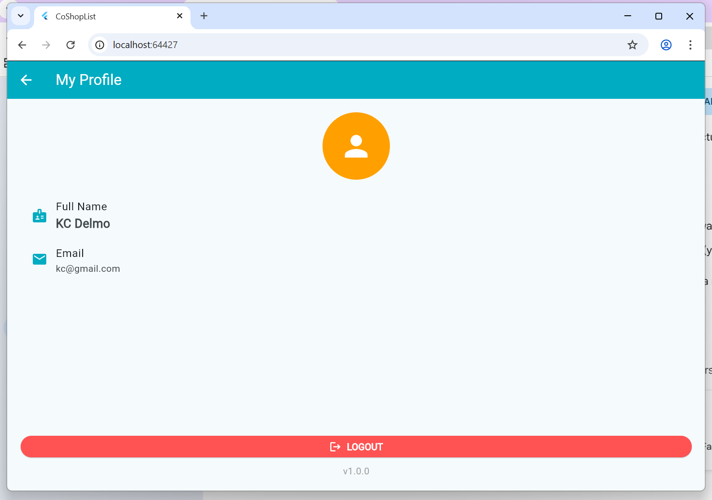

# CoShopList

## Description
**CoShopList** is a collaborative shopping list application designed for families and friends. It features real-time synchronization for grocery items, allowing every member to simultaneously add, check, and delete items using integrated cloud technology.

## Features
- **Real-time Synchronization:** Automatic lists updates to all users using Firebase Cloud Firestore
- **Collaborative Sharing:** Shopping list are could be share to other users through their email.
- **Advanced Gestures:** Swipe-to-delete (Dismissible) animation for quick and intuitive list clean up.
- **Visual Feedback:** Animated strikethrough and color fading for completed items.
- **Offline Support:** Lists are can be access and update even without internet connection.

## Screenshots

  
  
  
  
  

## Security Features (Course Goal 1)
- [x] **HTTPS for API calls:** All data transfer between Flutter and Firebase are protected by TLS/SSL encryption.
- [x] **No sensitive data in storage:** Do not share passwords or sensitive keys in local SharedPreferences.
- [x] **Input validation:** Has trim() and empty-check validation in login, registration, and item creation.
- [x] **Secure authentication:** Utilizes Firebase Auth for secure session management and user verification.
- [x] **Debug logs removed:** The production code is clean from any print() or debugPrint() statements.

## Why Flutter? (Course Goal 2)
We chose flutter as framework because of the following:
- **Fast Development:** Because of its *Hot Reload*, it is easier for us to adjust the UI and logic of the app.
- **Rich Animation Library:** It's more easier to implement complex animations such as *Dismissible* and *AnimatedDefaultTextStyle* using built-in widgets.
- **Cross-platform Benefit:** Can be deploy to multiple platforms like android and ios.
- **Firebase Integration:** Seamless connection of Flutter in Firebase ecosystem for real-time database needs.

## Setup Instructions
1. Clone repository: `git clone https://github.com/roces123/coshoplist.git`
2. Run `flutter pub get` to install dependencies.
3. Make sure that `google-services.json` was setup in `android/app/` folder
4. Run `flutter run` to launch app in emulator or phone
## Dependencies
- **firebase_core:** ^2.0.0 (Base Firebase setup)
- **firebase_auth:** ^4.0.0 (User Authentication)
- **cloud_firestore:** ^4.0.0 (Real-time Database)
- **provider:** ^6.1.1 (State Management)

## Author
**KC Delmo**
Information Technology Student - ISUFST
[kcdelmo489@gmail.com]
